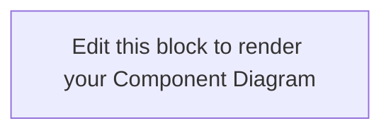
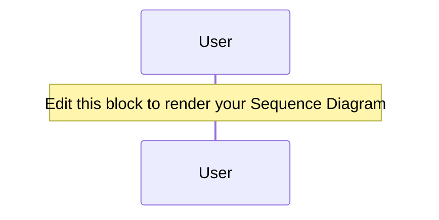

# ENPM611 Exercise: The Alignment Hub Architecture

Welcome to the **15-Minute Architecture Blueprint Challenge**!

In this exercise, you will reverse-engineer a specific slice of the `requirements-traceability` project. Rather than trying to map the entire repository, you will isolate and model the **Parser-to-Engine Boundary**. This is the exact architectural intersection where unstructured requirements text and raw source code files are parsed, structured, and cross-referenced to find gaps.

## 🎯 Learning Objectives

1. **Enforce Separation of Concerns:** Understand how parsing subsystems remain independent of analytical core logic.
2. **Define Interface Contracts:** Document how raw text files transition into clean Python data structures (lists, dictionaries) across module boundaries.
3. **Trace System Execution Lifespans:** Sequence how runtime dependencies dictate the order of execution.

---

## 💡 What is Mermaid.js and How Does It Work With Markdown?

**Mermaid.js** is a JavaScript-based diagramming and charting tool that uses a **text-to-diagram** approach. Instead of using a drag-and-drop tool (like Visio or Lucidchart) where shapes can become unaligned and files are saved as bulky binary objects, Mermaid lets you *program* your diagrams using simple, human-readable text syntax.

### How Markdown Integrates Mermaid

GitHub has built-in support for Mermaid. When you write a standard code block in a Markdown (`.md`) file, you normally specify the language (like `python` or `bash`) for syntax highlighting. If you specify `mermaid` instead, GitHub’s markdown engine intercepts the plain text and dynamically renders it as a crisp, interactive vector graphic (SVG).

An asset that looks like this in plain text code:

```text
```mermaid
graph LR
    A[User] --> B[System]
```‌
```

Automatically generates an interactive flowchart directly on the webpage! This means your documentation stays inside your repository, is fully searchable, and can be tracked using standard version control (`git diff`).

---

## 🛠️ Step-by-Step Workflow: How to Design and Copy Your Diagrams

To make your 15-minute window highly efficient, follow this professional workflow to draft, debug, and embed your diagrams:

### Step 1: Open the Tools

1. Open the official **[Mermaid Live Editor](https://mermaid.live)** in a separate browser tab. This tool gives you a split-screen interface: your text code on the left, and a real-time, auto-refreshing preview of the diagram on the right.
2. Keep the **[Mermaid Flowchart Documentation](https://js.org)** and **[Sequence Diagram Documentation](https://js.org)** open for quick syntax reference if you get stuck on advanced arrow shapes or loops.

### Step 2: Draft the First Diagram (Component / Flowchart)

1. Clear out the default placeholder code in the Mermaid Live Editor code pane (left side).
2. On line 1, declare the graph direction using `flowchart LR` (Left-to-Right layout is usually best for component interactions) or `flowchart TD` (Top-Down).
3. Define your first module by giving it an internal variable alias and a user-friendly label in brackets. For example: `Main["main.py (CLI Driver)"]`
4. Connect components using arrows. For example: `Main --> Parser["req_parser.py"]`.
5. If there is a syntax error, the Live Editor will turn red at the bottom and show an error message explaining exactly which line broke. Adjust your text until the diagram renders cleanly on the right.

### Step 3: Copying Back to Markdown

1. Once your diagram looks correct in the Live Editor, **do not export it as a PNG or JPEG**.
2. Simply highlight and **copy the raw text code** from the left pane of the editor.
3. Come back to your forked repository's `README.md` file on GitHub, click the edit button (pencil icon), scroll down to the student solution sections, and paste your code inside the designated triple-backtick (```` ```mermaid ````) blocks.

---

## ⏱️ The Challenge Prompt (15 Minutes)

You are tasked with designing a **Component Diagram** and a **Sequence Diagram** focusing strictly on three files in the repository layout:

1. `req_parser.py`
2. `code_scanner.py`
3. `trace_engine.py`

Assume `main.py` serves as the primary orchestrator that initiates this pipeline.

### Part 1: Component Diagram (7 Minutes)

Model the static structural relationships between your components. Your diagram must answer:

* **Isolation:** Are `req_parser` and `code_scanner` completely separated, or do they talk to each other? (Hint: They shouldn't!).
* **Data Contracts:** What explicit Python data structures or payload formats travel along the links into `trace_engine`?
* **Shared Dependencies:** If both modules rely on a Regular Expression (Regex) utility to extract strings, where does that dependency hook live?

**Component/Flowchart Syntax Quick Guide:**

* `[Rectangles]` are ideal for standard system modules (e.g., `req_parser.py`).
* `([Ovals])` or `[[Subroutines]]` represent supporting libraries or utility classes (e.g., `Regex Engine`).
* `-.->` represents a loose usage dependency, while `-->` represents a hard structural data line.
* You can add text to a link using a vertical bar syntax: `A -->|passes data| B`

### Part 2: Sequence Diagram (8 Minutes)

Model the runtime behavior and message passing over time. Your diagram must answer:

* **Temporal Order:** Does the tool pull requirements data first or crawl source code files first? Are they blocking operations?
* **Return Paths:** When an ingestion module finishes processing, where does its data go before the correlation process starts?
* **Algorithmic Loops:** How does the `trace_engine` visually represent its internal lookup check (e.g., iterating through requirement keys to hunt for orphaned or unmapped blocks)?

**Sequence Diagram Syntax Quick Guide:**

* Always start the diagram block with the single word `sequenceDiagram`.
* Use `participant Alias as "Display Name"` to declare your lifelines at the top.
* `->>` represents a synchronous function call or query message (solid line, solid arrowhead).
* `-->>` represents a return signal or callback path (dashed line, open arrowhead).
* Use `activate Alias` and `deactivate Alias` to show when a specific python module is actively doing computational work.

---

## 🚀 How to Submit

1. **Fork** this repository to your personal GitHub account.
2. Open this `README.md` file in an editor or directly on GitHub.
3. Locate the **Solution Sections** at the bottom of this file.
4. Replace the sample placeholder blocks with your customized Mermaid syntax.
5. Commit your changes and submit the link to your repository or file pull request as directed by your instructor.

---

# 📝 STUDENT SOLUTION SECTIONS

*Replace the code snippets below with your own solutions. Ensure your syntax sits cleanly between the triple-backtick markers.*

### Student Component Diagram



### Student Sequence Diagram


